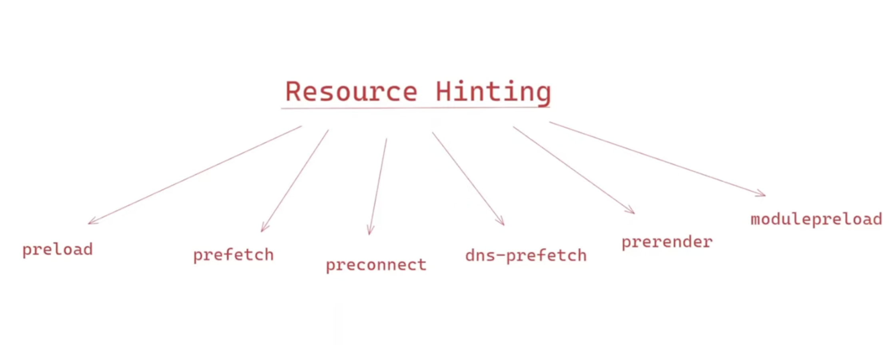

# Network Optimization Techniques

## Lazy loading

### `lazy` attribute:

`lazy` attribute on image tag ``, by default setting is ``

### Intersection observer API:


```
function callbackFunction(entries) {
  entries.forEach(entry => {...})
}

let observer = new IntersectionObserver(callbackFunction, {
  root: null,
  rootMargin: '0px',
  threshold: 0.5
})
```

### `content-visibility` css property:


```
.content {
  content-visibility: auto;
}
```

### Serving critical css


```
Loading critical css synchronously
<link rel="stylesheet" href="critical.css" />

Loading CSS asynchronously with low priority
<link
  rel="stylesheet" href="full.css" media="print" onload="this.media='all'">
```

## Resource hinting


